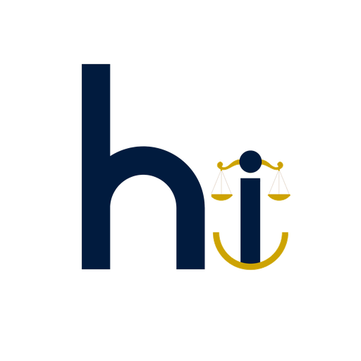

<p align="center">
  
</p>

<h3 align="center">Think human intelligence.</h3>

<p align="center">
  Every company gets a HI Grade™. Brands that empower humans score well.<br>
  Brands that replace, divide, or addict them score poorly.
</p>

<p align="center">
  <a href="https://thehibalance.org">Website</a> ·
  <a href="https://apps.apple.com/app/hi/id6761270596">App Store</a> ·
  <a href="https://chromewebstore.google.com/detail/cpahbhdlmeinoaffjcpnnofgebcblkhg">Chrome Extension</a> ·
  <a href="https://api.thehibalance.org/api/v1/stats">API</a>
</p>

<p align="center">
  <em>Built without AI to measure AI. 42 free data sources. 24 sub-signals. Zero black boxes.</em>
</p>

---

## The HUMAN Framework

Five dimensions of humanity. Five things AI can't replicate.

| Dimension | Measures |
|-----------|----------|
| 🧠 **H** — Human Consciousness | Creative agency, craft, accountability, and whether humans meaningfully shape outcomes |
| 💙 **U** — Understanding & Empathy | Real human empathy toward workers, customers, and communities — or AI-simulated empathy |
| ⚖️ **M** — Moral & Ethical Conduct | Pricing ethics, data ethics, market behavior, CEO accountability, and leadership pay equity |
| 🌍 **A** — Alive & Environmental | True environmental cost including the hidden footprint of AI infrastructure |
| 🔍 **N** — Natural Transparency | Genuinely open about AI usage, environmental impact, and labor practices — or humanwashing |

---

## Gold HI Grade — 3 Gates

Every company gets a score from 0 to 100. Pass all three gates? Gold.

**1. Score** — Composite above the adaptive threshold (mean + 2σ, recalculated quarterly, ratchet up only)

**2. Balance** — All 5 dimensions ≥ 42. No blind spots.

**3. Integrity** — No Humanwashing™ flags. Algorithmic Harm Index™ below 30.

The first certification that certifies itself. You can't buy it. You can't apply for it. The data proves it.

---

## What Makes This Different

- **24 sub-signals, zero AI.** 42 free public and government data sources: SEC EDGAR, CFPB, OSHA, FEC, CPSC, FDA, HIBP, iFixit, SBTi, GRI, and more.
- **Humanwashing™ detection.** Revenue/employee ratio, headcount vs AI spend, disclosed vs detected AI usage.
- **Algorithmic Harm Index™.** Cross-cutting penalty for algorithms that divide, addict, or manipulate.
- **H.5 Augmentation Bonus.** Companies that retrain, redeploy, and deploy AI as copilots are rewarded — not just penalized for displacement.
- **Subsidiary Transparency Rule.** You can't earn Gold by hiding displacement in a shell company.
- **Daily history tracking.** Score snapshots captured nightly. Stock price correlation. HUMAN 100 vs S&P 500 backtest engine.
- **3-layer validation.** Input checks, output distribution analysis, and MSSI limits before any score publishes.

---

## Architecture

```
┌───────────────────────────────────┐
│           EDGE NODE               │
│     (Browser Extension)           │
│  • Zero AI · Zero tracking        │
│  • 3 gates: Score, Balance,       │
│    Integrity                      │
│  • 200 seed + 827+ cloud          │
└──────────┬────────────────────────┘
           │
           ▼
┌───────────────────────────────────┐
│        DETERMINISTIC CLOUD        │
│     (Railway + GitHub Pages)      │
│  • 42 data pipelines              │
│  • 32 API endpoints               │
│  • History tracker + backtest     │
│  • No AI. Pure math.              │
└──────────┬────────────────────────┘
           │
           ▼
┌───────────────────────────────────┐
│      AI ENHANCEMENT LAYER         │
│     (Coming · OFF by default)     │
│  "The telescope gets sharper.     │
│   It doesn't move the stars."     │
└───────────────────────────────────┘
```

---

## Pipeline

Runs nightly via GitHub Actions:

```
Step 1:   Data collection (34 original sources)
Step 1b:  CFPB + OSHA (government data, normalized)
Step 1c:  FEC + CPSC + FDA + HIBP
Step 2:   Scoring engine (24 sub-signals)
Step 3:   Merge seed data (200 companies)
Step 4:   Feature pipelines (Shield, Contagion, Lens, Wave, Watermark)
Step 5:   HUMAN 100 Index
Step 6:   Threshold recalculation
Step 7:   3-layer validation
Step 8:   History snapshot + price capture + backtest
```

---

## What's in This Repo

```
hi/
├── human-edge/              # Chrome extension (Manifest V3)
│   ├── manifest.json
│   ├── content.js           # Human silhouette pill + panel
│   └── lib/
│       ├── seed-data.js     # 200 companies with domains
│       └── engine.js        # Deterministic engine + 3 gates
│
├── pipeline/                # Cloud scoring pipeline
│   ├── run_all.py           # collect → score → merge → features → history
│   ├── data_collector.py    # 34 original data sources
│   ├── collect_gov_data.py  # CFPB + OSHA
│   ├── collect_extra_sources.py  # FEC + CPSC + FDA + HIBP
│   ├── scoring_engine.py    # HUMAN scoring + threshold
│   ├── merge_seed.py        # 200 private companies
│   ├── feature_pipelines.py # Shield, Contagion, Lens, Wave, Watermark
│   ├── history_tracker.py   # Daily snapshots + prices + backtest
│   ├── validate_pipeline.py # 3-layer validation
│   └── api_server.py        # Flask REST API (32 endpoints)
│
├── ios/                     # iOS app (Swift/SwiftUI)
│
├── docs/                    # Website (GitHub Pages)
│   ├── index.html
│   └── privacy.html
│
└── .github/workflows/
    └── daily-pipeline.yml   # Nightly + quarterly automation
```

---

## API

Base URL: `https://api.thehibalance.org` · Free · No auth required

| Endpoint | Description |
|----------|-------------|
| `/api/v1/stats` | Stats + Gold threshold |
| `/api/v1/score/{domain}` | Score by domain |
| `/api/v1/score/ticker/{ticker}` | Score by ticker |
| `/api/v1/search?q={query}` | Search companies |
| `/api/v1/human100` | HUMAN 100 Index |
| `/api/v1/heartbeat/pulse` | Ecosystem pulse |
| `/api/v1/heartbeat/alerts` | Decay alerts |
| `/api/v1/arbitrage` | HUMAN Lens |
| `/api/v1/moat` | HUMAN Shield |
| `/api/v1/contagion` | HUMAN Contagion |

---

## Quick Start

```bash
# Extension
git clone https://github.com/thehibalance/hi.git
# chrome://extensions → Developer mode → Load unpacked → human-edge/

# Pipeline
cd pipeline && python3 run_all.py

# Incremental
python3 run_all.py --incremental 24

# Quarterly (recalculates Gold threshold)
python3 run_all.py --quarterly
```

---

## Privacy

The extension collects **zero user data**. No tracking, no analytics, no cookies, no browsing history. Full policy: [thehibalance.org/privacy.html](https://thehibalance.org/privacy.html)

---

## Live Now

| Surface | Link | Status |
|---------|------|--------|
| Website | [thehibalance.org](https://thehibalance.org) | ✅ Live |
| iOS App | [App Store](https://apps.apple.com/app/hi/id6761270596) | ✅ Live |
| Chrome Extension | [Chrome Web Store](https://chromewebstore.google.com/detail/cpahbhdlmeinoaffjcpnnofgebcblkhg) | ✅ Live |
| API | [api.thehibalance.org](https://api.thehibalance.org/api/v1/stats) | ✅ Live |
| Pipeline | GitHub Actions | ✅ Nightly |
| Safari Extension | — | Coming Soon |
| Google Play | — | Coming Soon |

---

*"Don't panic. Every journey starts somewhere. The data will get better. The gates will get harder. The companies will adapt. That's the point."*

**Bringing balance to the workforce.**

The HI Balance · Patent Pending · HI Grade™ · Morf Innovations LLC

[thehibalance.org](https://thehibalance.org) · [@thehibalance](https://twitter.com/thehibalance)
